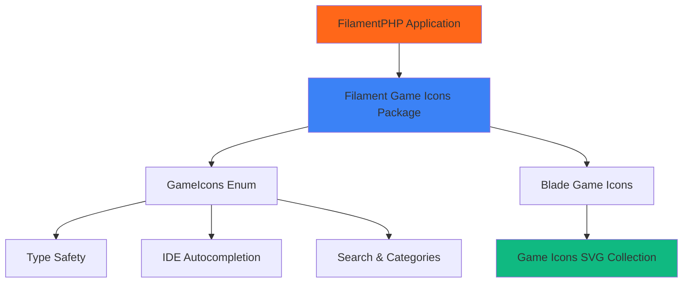

# 🎮 Filament Game Icons

<div align="center">


<div align="center">
    
</div>

**The ultimate Game Icons collection for FilamentPHP**

[](https://packagist.org/packages/alizharb/filament-game-icons)
[](https://packagist.org/packages/alizharb/filament-game-icons)
[](LICENSE)
[](https://packagist.org/packages/alizharb/filament-game-icons)

[](https://scrutinizer-ci.com/g/alizharb/filament-game-icons)
[](https://filamentphp.com)

_Transform your FilamentPHP applications with 4000+ beautiful game icons_

[📖 Documentation](#-documentation) • [🚀 Quick Start](#-quick-start) • [💡 Examples](#-examples) • [🤝 Contributing](#-contributing)

</div>

---

## ✨ Features

<table>
<tr>
<td width="50%">

### 🎯 **Core Features**

- 🎮 **4000+ Game Icons** - Complete collection from game-icons.net
- 🔧 **Type Safe** - Full PHP enum with IDE autocompletion
- 🏷️ **Human Readable** - Implements `HasLabel` for better UX
- 📦 **Zero Config** - Works out of the box
- ⚡ **Optimized** - Blazing fast with smart caching

</td>
<td width="50%">

### 🛠️ **Developer Experience**

- 🔍 **Searchable** - Built-in search and categorization
- 🎨 **Customizable** - Easy theming and icon replacement
- 📱 **Responsive** - Looks great on all devices
- 🔄 **Auto-sync** - Keep icons updated automatically
- 💡 **IntelliSense** - Full IDE support

</td>
</tr>
</table>

---

## 🚀 Quick Start

### Installation

Install the package via Composer:

```bash
composer require alizharb/filament-game-icons
```

### Asset Registration

Register the assets with FilamentPHP:

```bash
php artisan filament:assets
```

### Basic Usage

Start using Game Icons immediately in any FilamentPHP component:

```php
use Alizharb\FilamentGameIcons\Enums\GameIcons;
use Filament\Actions\Action;

Action::make('attack')
    ->icon(GameIcons::Sword)
    ->label('Attack with Sword')
    ->color('danger');
```

---

## 📖 Documentation

### 🏗️ **Architecture Overview**



### 🎯 **Component Integration**

<details>
<summary><strong>📋 Actions & Buttons</strong></summary>

```php
use Alizharb\FilamentGameIcons\Enums\GameIcons;
use Filament\Actions\Action;

// Basic action with icon
Action::make('attack')
    ->icon(GameIcons::Sword)
    ->color('danger')
    ->requiresConfirmation();

// Grouped actions
Action::make('combat_menu')
    ->icon(GameIcons::CrossedSwords)
    ->actions([
        Action::make('attack')->icon(GameIcons::Sword),
        Action::make('defend')->icon(GameIcons::Shield),
        Action::make('cast_spell')->icon(GameIcons::MagicSwirl),
    ]);
```

</details>

<details>
<summary><strong>📝 Form Components</strong></summary>

```php
use Filament\Forms\Components\{Select, Toggle, Radio, Checkbox};

// Enhanced select with searchable icons
Select::make('character_class')
    ->options(GameIcons::getCharactersArray())
    ->searchable()
    ->native(false)
    ->allowHtml()
    ->placeholder('Choose your character class...');

// Toggle with custom icons
Toggle::make('is_magical')
    ->onIcon(GameIcons::MagicSwirl)
    ->offIcon(GameIcons::Sword)
    ->onColor('primary')
    ->offColor('gray');

// Radio with descriptions
Radio::make('weapon_preference')
    ->options(GameIcons::getWeaponsArray())
    ->descriptions([
        GameIcons::Sword->value => 'Balanced attack and defense',
        GameIcons::BowArrow->value => 'Long-range precision strikes',
        GameIcons::MagicSwirl->value => 'Powerful elemental damage',
    ]);
```

</details>

<details>
<summary><strong>📊 Table Columns</strong></summary>

```php
use Filament\Tables\Columns\{IconColumn, TextColumn};

// Dynamic status icons
IconColumn::make('player_status')
    ->icon(fn ($record): string => match ($record->status) {
        'online' => GameIcons::Person->value,
        'in_battle' => GameIcons::CrossedSwords->value,
        'resting' => GameIcons::Sleep->value,
        'offline' => GameIcons::Skull->value,
    })
    ->color(fn ($record): string => match ($record->status) {
        'online' => 'success',
        'in_battle' => 'warning',
        'resting' => 'info',
        'offline' => 'gray',
    })
    ->tooltip(fn ($record): string => "Player is {$record->status}");

// Equipment column with multiple icons
TextColumn::make('equipment')
    ->formatStateUsing(function ($record): string {
        $icons = [];
        if ($record->weapon) $icons[] = GameIcons::Sword->value;
        if ($record->armor) $icons[] = GameIcons::Armor->value;
        if ($record->magic_item) $icons[] = GameIcons::MagicSwirl->value;

        return view('components.icon-list', compact('icons'))->render();
    });
```

</details>

<details>
<summary><strong>📱 Widgets & Dashboard</strong></summary>

```php
use Filament\Widgets\StatsOverviewWidget as BaseWidget;
use Filament\Widgets\StatsOverviewWidget\Stat;

class GameDashboardWidget extends BaseWidget
{
    protected function getStats(): array
    {
        return [
            Stat::make('👥 Active Players', $this->getActivePlayers())
                ->description('Currently online')
                ->descriptionIcon(GameIcons::Person->value)
                ->chart([7, 2, 10, 3, 15, 4, 17])
                ->color('success'),

            Stat::make('⚔️ Battles Today', $this->getBattlesToday())
                ->description('32% increase from yesterday')
                ->descriptionIcon(GameIcons::CrossedSwords->value)
                ->color('warning'),

            Stat::make('🏆 Achievements', $this->getAchievements())
                ->description('Unlocked this week')
                ->descriptionIcon(GameIcons::Trophy->value)
                ->color('primary'),

            Stat::make('💰 Gold Earned', number_format($this->getGoldEarned()))
                ->description('Total server economy')
                ->descriptionIcon(GameIcons::GoldStack->value)
                ->color('warning'),
        ];
    }
}
```

</details>

---

## 🗂️ Icon Categories

<div align="center">

| Category             | Count | Examples                               | Usage                        |
| -------------------- | ----- | -------------------------------------- | ---------------------------- |
| **⚔️ Weapons**       | 500+  | `Sword`, `BowArrow`, `Shield`, `Axe`   | Combat systems, inventory    |
| **🔮 Magic**         | 300+  | `MagicSwirl`, `HealingPotion`, `Rune`  | Spell systems, enchantments  |
| **👤 Characters**    | 200+  | `Wizard`, `Warrior`, `Archer`, `Rogue` | Character selection, classes |
| **🐉 Creatures**     | 400+  | `Dragon`, `Wolf`, `Phoenix`, `Demon`   | Bestiary, enemy systems      |
| **💎 Items**         | 600+  | `Armor`, `Crown`, `Gem`, `Treasure`    | Inventory, rewards           |
| **🎲 Dice & Gaming** | 50+   | `D4`, `D6`, `D20`, `Cards`             | Game mechanics, RNG          |
| **🏰 Environment**   | 300+  | `Castle`, `Forest`, `Cave`, `Tower`    | World building, locations    |
| **⚙️ Interface**     | 200+  | `Settings`, `Menu`, `Save`, `Load`     | UI elements, navigation      |

</div>

---

## 💡 Examples

### 🎮 Complete Gaming Resource

<details>
<summary><strong>Character Management System</strong></summary>

```php
<?php

namespace App\Filament\Resources;

use Alizharb\FilamentGameIcons\Enums\GameIcons;
use Filament\Forms;
use Filament\Forms\Form;
use Filament\Resources\Resource;
use Filament\Tables;
use Filament\Tables\Table;

class CharacterResource extends Resource
{
    protected static ?string $model = Character::class;
    protected static ?string $navigationIcon = 'gameicon-person';
    protected static ?string $navigationGroup = 'Game Management';

    public static function form(Form $form): Form
    {
        return $form
            ->schema([
                Forms\Components\Section::make('Character Information')
                    ->icon(GameIcons::Person->value)
                    ->schema([
                        Forms\Components\TextInput::make('name')
                            ->required()
                            ->maxLength(255)
                            ->live(onBlur: true)
                            ->prefixIcon(GameIcons::Scroll->value),

                        Forms\Components\Select::make('class')
                            ->options([
                                'warrior' => 'Warrior',
                                'wizard' => 'Wizard',
                                'archer' => 'Archer',
                                'rogue' => 'Rogue',
                                'paladin' => 'Paladin',
                                'druid' => 'Druid',
                            ])
                            ->required()
                            ->searchable()
                            ->native(false)
                            ->prefixIcon(GameIcons::Person->value),

                        Forms\Components\Select::make('race')
                            ->options(GameIcons::getCreaturesArray())
                            ->searchable()
                            ->native(false)
                            ->prefixIcon(GameIcons::Dragon->value),
                    ]),

                Forms\Components\Section::make('Equipment & Stats')
                    ->icon(GameIcons::Sword->value)
                    ->schema([
                        Forms\Components\Select::make('primary_weapon')
                            ->options(GameIcons::getWeaponsArray())
                            ->searchable()
                            ->native(false)
                            ->prefixIcon(GameIcons::Sword->value),

                        Forms\Components\Select::make('armor_type')
                            ->options([
                                'light' => 'Light Armor',
                                'medium' => 'Medium Armor',
                                'heavy' => 'Heavy Armor',
                            ])
                            ->prefixIcon(GameIcons::Armor->value),

                        Forms\Components\Grid::make(3)
                            ->schema([
                                Forms\Components\TextInput::make('level')
                                    ->numeric()
                                    ->default(1)
                                    ->minValue(1)
                                    ->maxValue(100)
                                    ->prefixIcon(GameIcons::Trophy->value),

                                Forms\Components\TextInput::make('health')
                                    ->numeric()
                                    ->default(100)
                                    ->minValue(0)
                                    ->prefixIcon(GameIcons::Heart->value),

                                Forms\Components\TextInput::make('mana')
                                    ->numeric()
                                    ->default(50)
                                    ->minValue(0)
                                    ->prefixIcon(GameIcons::MagicSwirl->value),
                            ]),
                    ]),

                Forms\Components\Section::make('Status & Abilities')
                    ->icon(GameIcons::Lightning->value)
                    ->schema([
                        Forms\Components\Toggle::make('is_alive')
                            ->default(true)
                            ->onIcon(GameIcons::Heart->value)
                            ->offIcon(GameIcons::Skull->value)
                            ->onColor('success')
                            ->offColor('danger'),

                        Forms\Components\CheckboxList::make('abilities')
                            ->options([
                                'stealth' => 'Stealth',
                                'magic_resistance' => 'Magic Resistance',
                                'critical_strike' => 'Critical Strike',
                                'healing' => 'Healing',
                                'fire_immunity' => 'Fire Immunity',
                            ])
                            ->columns(2),

                        Forms\Components\Textarea::make('backstory')
                            ->rows(4)
                            ->placeholder('Tell us about your character\'s history...')
                            ->columnSpanFull(),
                    ]),
            ]);
    }

    public static function table(Table $table): Table
    {
        return $table
            ->columns([
                Tables\Columns\ImageColumn::make('avatar')
                    ->circular()
                    ->defaultImageUrl(fn ($record) => 'https://ui-avatars.com/api/?name=' . urlencode($record->name)),

                Tables\Columns\TextColumn::make('name')
                    ->searchable()
                    ->sortable()
                    ->weight('bold'),

                Tables\Columns\IconColumn::make('class')
                    ->icon(fn (string $state): string => match ($state) {
                        'warrior' => GameIcons::Warrior->value,
                        'wizard' => GameIcons::Wizard->value,
                        'archer' => GameIcons::Archer->value,
                        'rogue' => GameIcons::Rogue->value,
                        'paladin' => GameIcons::Paladin->value,
                        'druid' => GameIcons::Druid->value,
                        default => GameIcons::Person->value,
                    })
                    ->color(fn (string $state): string => match ($state) {
                        'warrior' => 'danger',
                        'wizard' => 'info',
                        'archer' => 'success',
                        'rogue' => 'warning',
                        'paladin' => 'primary',
                        'druid' => 'success',
                        default => 'gray',
                    })
                    ->tooltip(fn ($record): string => ucfirst($record->class)),

                Tables\Columns\ProgressColumn::make('health')
                    ->getStateUsing(fn ($record): float => $record->health / $record->max_health * 100)
                    ->color('success')
                    ->alignment('center'),

                Tables\Columns\TextColumn::make('level')
                    ->badge()
                    ->color('warning')
                    ->sortable(),

                Tables\Columns\IconColumn::make('is_alive')
                    ->boolean()
                    ->trueIcon(GameIcons::Heart->value)
                    ->falseIcon(GameIcons::Skull->value)
                    ->trueColor('success')
                    ->falseColor('danger'),

                Tables\Columns\TextColumn::make('created_at')
                    ->dateTime()
                    ->sortable()
                    ->toggleable(isToggledHiddenByDefault: true),
            ])
            ->defaultSort('level', 'desc')
            ->filters([
                Tables\Filters\SelectFilter::make('class')
                    ->options([
                        'warrior' => 'Warrior',
                        'wizard' => 'Wizard',
                        'archer' => 'Archer',
                        'rogue' => 'Rogue',
                        'paladin' => 'Paladin',
                        'druid' => 'Druid',
                    ])
                    ->indicator('Character Class'),

                Tables\Filters\Filter::make('alive_only')
                    ->label('Alive Characters Only')
                    ->query(fn ($query) => $query->where('is_alive', true))
                    ->default(),
            ])
            ->actions([
                Tables\Actions\ActionGroup::make([
                    Tables\Actions\ViewAction::make()
                        ->icon(GameIcons::Eye->value),

                    Tables\Actions\EditAction::make()
                        ->icon(GameIcons::Scroll->value),

                    Tables\Actions\Action::make('heal')
                        ->icon(GameIcons::HealingPotion->value)
                        ->color('success')
                        ->action(fn ($record) => $record->heal())
                        ->visible(fn ($record) => $record->health < $record->max_health),

                    Tables\Actions\Action::make('revive')
                        ->icon(GameIcons::Resurrection->value)
                        ->color('warning')
                        ->requiresConfirmation()
                        ->action(fn ($record) => $record->revive())
                        ->visible(fn ($record) => !$record->is_alive),
                ])
                ->icon(GameIcons::Menu->value),
            ])
            ->bulkActions([
                Tables\Actions\BulkActionGroup::make([
                    Tables\Actions\BulkAction::make('mass_heal')
                        ->icon(GameIcons::HealingPotion->value)
                        ->color('success')
                        ->action(fn ($records) => $records->each->heal()),

                    Tables\Actions\DeleteBulkAction::make()
                        ->icon(GameIcons::Skull->value),
                ]),
            ])
            ->emptyStateIcon(GameIcons::Person->value)
            ->emptyStateHeading('No characters yet')
            ->emptyStateDescription('Create your first character to begin your adventure!');
    }
}
```

</details>

<details>
<summary><strong>📊 Advanced Dashboard Widgets</strong></summary>

```php
use Filament\Widgets\ChartWidget;
use Filament\Widgets\StatsOverviewWidget as BaseWidget;

class GameStatsWidget extends BaseWidget
{
    protected function getStats(): array
    {
        return [
            Stat::make('🎮 Active Players', $this->getActivePlayers())
                ->description('Currently online')
                ->descriptionIcon(GameIcons::Person->value)
                ->chart($this->getPlayerChart())
                ->color('success')
                ->extraAttributes(['class' => 'game-stat-card']),

            Stat::make('⚔️ Battles This Hour', $this->getBattlesThisHour())
                ->description('Peak combat activity')
                ->descriptionIcon(GameIcons::CrossedSwords->value)
                ->chart($this->getBattleChart())
                ->color('danger'),

            Stat::make('🏆 Achievements Unlocked', $this->getAchievementsToday())
                ->description('New achievements today')
                ->descriptionIcon(GameIcons::Trophy->value)
                ->color('warning'),

            Stat::make('💰 Server Economy', '$' . number_format($this->getTotalGold()))
                ->description('Total gold in circulation')
                ->descriptionIcon(GameIcons::GoldStack->value)
                ->color('primary'),
        ];
    }
}

class PlayerActivityChart extends ChartWidget
{
    protected static ?string $heading = 'Player Activity';
    protected static string $color = 'info';
    protected static ?string $icon = 'gameicon-person';

    protected function getData(): array
    {
        return [
            'datasets' => [
                [
                    'label' => 'Online Players',
                    'data' => [65, 78, 66, 44, 56, 67, 75],
                    'backgroundColor' => 'rgba(59, 130, 246, 0.1)',
                    'borderColor' => 'rgb(59, 130, 246)',
                ],
            ],
            'labels' => ['Mon', 'Tue', 'Wed', 'Thu', 'Fri', 'Sat', 'Sun'],
        ];
    }

    protected function getType(): string
    {
        return 'line';
    }
}
```

</details>

---

## 🔧 API Reference

### 🏷️ **GameIcons Enum Methods**

```php
// Core functionality
GameIcons::Sword->getLabel();           // "Sword"
GameIcons::Sword->value;                // "gameicon-sword"
GameIcons::toSelectArray();             // All icons as options
GameIcons::search('magic');             // Search icons
GameIcons::random();                    // Get random icon

// Category methods
GameIcons::getWeapons();                // Array of weapon icons
GameIcons::getMagic();                  // Array of magic icons
GameIcons::getCharacters();             // Array of character icons
GameIcons::getCreatures();              // Array of creature icons
GameIcons::getDice();                   // Array of dice icons

// Category arrays (for selects)
GameIcons::getWeaponsArray();           // ['gameicon-sword' => 'Sword', ...]
GameIcons::getMagicArray();             // ['gameicon-magic-swirl' => 'Magic Swirl', ...]
GameIcons::getCharactersArray();        // ['gameicon-wizard' => 'Wizard', ...]

// Utility methods
GameIcons::make('custom-icon');         // "gameicon-custom-icon"
GameIcons::count();                     // Total number of icons
GameIcons::categories();                // Available categories
```

### 🔍 **Search & Filtering**

```php
// Advanced search
$results = GameIcons::search('sword', [
    'category' => 'weapons',
    'limit' => 10,
    'exact' => false
]);

// Filter by multiple criteria
$filtered = GameIcons::filter([
    'categories' => ['weapons', 'magic'],
    'exclude' => ['skull', 'death'],
    'include_only' => ['fire', 'ice', 'lightning']
]);

// Get icons by pattern
$elementalIcons = GameIcons::pattern('/^(fire|ice|lightning|earth)/i');
```

---

## ⚙️ Configuration

### 🎨 **Custom Styling**

Publish and customize the CSS:

```bash
php artisan vendor:publish --tag=filament-game-icons-styles
```

```css
/* resources/css/filament-game-icons.css */
.game-icon {
  transition: all 0.2s ease-in-out;
}

.game-icon:hover {
  transform: scale(1.1);
  filter: drop-shadow(0 4px 8px rgba(0, 0, 0, 0.2));
}

/* Size variants */
.game-icon-xs {
  width: 0.75rem;
  height: 0.75rem;
}
.game-icon-sm {
  width: 1rem;
  height: 1rem;
}
.game-icon-md {
  width: 1.5rem;
  height: 1.5rem;
}
.game-icon-lg {
  width: 2rem;
  height: 2rem;
}
.game-icon-xl {
  width: 3rem;
  height: 3rem;
}

/* Color themes */
.game-icon-fire {
  color: #ef4444;
}
.game-icon-ice {
  color: #3b82f6;
}
.game-icon-nature {
  color: #10b981;
}
.game-icon-shadow {
  color: #6b7280;
}
```

### 🔧 **Icon Replacement**

Replace default FilamentPHP icons system-wide:

```php
// In your AppServiceProvider boot() method
use Filament\Support\Facades\FilamentIcon;
use Filament\View\PanelsIconAlias;
use Alizharb\FilamentGameIcons\Enums\GameIcons;

public function boot(): void
{
    FilamentIcon::register([
        // Navigation
        PanelsIconAlias::PANELS_SIDEBAR_COLLAPSE_BUTTON => GameIcons::Menu->value,
        PanelsIconAlias::PANELS_SIDEBAR_EXPAND_BUTTON => GameIcons::Menu->value,

        // Actions
        PanelsIconAlias::ACTIONS_CREATE_ACTION => GameIcons::Plus->value,
        PanelsIconAlias::ACTIONS_EDIT_ACTION => GameIcons::Scroll->value,
        PanelsIconAlias::ACTIONS_DELETE_ACTION => GameIcons::Skull->value,
        PanelsIconAlias::ACTIONS_VIEW_ACTION => GameIcons::Eye->value,

        // Tables
        PanelsIconAlias::TABLES_SEARCH_FIELD => GameIcons::Search->value,
        PanelsIconAlias::TABLES_FILTER => GameIcons::Filter->value,

        // Global
        PanelsIconAlias::GLOBAL_SEARCH_FIELD => GameIcons::Search->value,
    ]);
}
```

---

### 🎮 **Gaming-Specific Helpers**

```php
// RPG character creation helpers
$characterIcons = GameIcons::forRPGClasses();
$weaponsByType = GameIcons::weaponsByType();
$spellsBySchool = GameIcons::spellsBySchool();

// Board game helpers
$diceSet = GameIcons::getStandardDiceSet(); // D4, D6, D8, D10, D12, D20
$cardSuits = GameIcons::getCardSuits();
$gamepieces = GameIcons::getGamePieces();
```

---

## 🛠️ Management Commands

### 📥 **Sync Command**

Keep your icons up-to-date with the latest from game-icons.net:

```bash
# Sync icons (with backup)
php artisan sync:game-icons-enum

# Dry run (preview changes)
php artisan sync:game-icons-enum --dry-run
```

---

## 🎨 Theming Examples

### 🌙 **Dark Mode Support**

```php
// Automatic dark mode adaptation
IconColumn::make('status')
    ->icon(GameIcons::Heart->value)
    ->color('success')
    ->extraAttributes([
        'class' => 'dark:filter dark:brightness-110'
    ]);
```

### 🎭 **Custom Icon Themes**

```php
// Create themed icon sets
class ThemeManager
{
    public static function getFireTheme(): array
    {
        return [
            'primary' => GameIcons::Fire->value,
            'secondary' => GameIcons::Explosion->value,
            'accent' => GameIcons::Lightning->value,
            'background' => GameIcons::Flame->value,
        ];
    }

    public static function getIceTheme(): array
    {
        return [
            'primary' => GameIcons::Ice->value,
            'secondary' => GameIcons::Snowflake->value,
            'accent' => GameIcons::Crystal->value,
            'background' => GameIcons::Blizzard->value,
        ];
    }
}
```

---

## 🧪 Testing

### Running Tests

```bash
# Run all tests
composer test

# Run with coverage
composer test-coverage

# Run specific test suite
./vendor/bin/pest --group=integration

# Run performance tests
./vendor/bin/pest --group=performance
```

### 🎯 **Test Examples**

```php
<?php

use Alizharb\FilamentGameIcons\Enums\GameIcons;
use Alizharb\FilamentGameIcons\Tests\TestCase;

class GameIconsTest extends TestCase
{
    /** @test */
    public function it_can_get_icon_labels(): void
    {
        expect(GameIcons::Sword->getLabel())->toBe('Sword');
        expect(GameIcons::MagicSwirl->getLabel())->toBe('Magic Swirl');
    }

    /** @test */
    public function it_can_search_icons(): void
    {
        $results = GameIcons::search('sword');

        expect($results)->toContain(GameIcons::Sword);
        expect($results)->toContain(GameIcons::CrossedSwords);
    }

    /** @test */
    public function it_can_get_category_arrays(): void
    {
        $weapons = GameIcons::getWeaponsArray();

        expect($weapons)->toBeArray();
        expect($weapons)->toHaveKey(GameIcons::Sword->value);
        expect($weapons[GameIcons::Sword->value])->toBe('Sword');
    }
}
```

---

## 🚀 Performance

### ⚡ **Optimization Features**

- **Smart Caching**: Icons are cached for maximum performance
- **Lazy Loading**: Only loads icons when needed
- **SVG Optimization**: Minified SVG files for faster loading
- **Bundle Splitting**: Load only the categories you need

---

## 🔒 Security

### 🛡️ **Security Features**

- ✅ **XSS Protection**: All icon names are sanitized
- ✅ **Path Traversal Prevention**: Secure file handling
- ✅ **Input Validation**: Strict type checking
- ✅ **No Executable Code**: Pure SVG icons only

### 🔍 **Security Testing**

```bash
# Run security analysis
composer security-check

# Static analysis
./vendor/bin/phpstan analyse

# Code quality check
./vendor/bin/php-cs-fixer fix --dry-run
```

---

## 🔌 Plugin Integration

### 🎯 **Popular FilamentPHP Plugin Compatibility**

<div align="center">

| Plugin                     | Status          | Integration Example                                   |
| -------------------------- | --------------- | ----------------------------------------------------- |
| **Filament Tables**        | ✅ Full Support | `IconColumn::make()->icon(GameIcons::Sword)`          |
| **Filament Forms**         | ✅ Full Support | `Select::make()->options(GameIcons::toSelectArray())` |
| **Filament Actions**       | ✅ Full Support | `Action::make()->icon(GameIcons::Attack)`             |
| **Filament Widgets**       | ✅ Full Support | `Stat::make()->descriptionIcon(GameIcons::Trophy)`    |
| **Filament Notifications** | ✅ Full Support | `Notification::make()->icon(GameIcons::Success)`      |

</div>

### 🔗 **Third-party Integrations**

```php
// Spatie Media Library
use Spatie\MediaLibrary\HasMedia;

class Character extends Model implements HasMedia
{
    public function getAvatarIconAttribute(): string
    {
        return $this->class ? GameIcons::getClassIcon($this->class) : GameIcons::Person->value;
    }
}
```

---

## 🚀 Migration Guide

### ⬆️ **From Heroicons to Game Icons**

```php
// Before (Heroicons)
Action::make('delete')
    ->icon('heroicon-o-trash')
    ->color('danger');

// After (Game Icons)
Action::make('delete')
    ->icon(GameIcons::Skull)
    ->color('danger');
```

---

## 🤝 Contributing

We love contributions! Here's how you can help make this package even better:

### 🎯 **Ways to Contribute**

- 🐛 **Bug Reports**: Found an issue? [Report it here](https://github.com/alizharb/filament-game-icons/issues)
- 💡 **Feature Requests**: Got an idea? [Share it with us](https://github.com/alizharb/filament-game-icons/issues)
- 📝 **Documentation**: Help improve our docs
- 🧪 **Testing**: Add more test cases
- 🎨 **Icon Categories**: Suggest new categorizations

### 🛠️ **Development Setup**

```bash
# Clone the repository
git clone https://github.com/alizharb/filament-game-icons.git
cd filament-game-icons

# Install dependencies
composer install

# Set up testing environment
cp .env.example .env
php artisan key:generate

# Run tests
composer test

# Code quality checks
composer lint
composer analyse
```

### 📋 **Contribution Guidelines**

1. **Fork** the repository
2. **Create** a feature branch (`git checkout -b feature/amazing-feature`)
3. **Commit** your changes (`git commit -m 'Add amazing feature'`)
4. **Push** to the branch (`git push origin feature/amazing-feature`)
5. **Open** a Pull Request

---

## 📋 Requirements

<div align="center">

| Requirement          | Version            | Status            |
| -------------------- | ------------------ | ----------------- |
| **PHP**              | 8.1+               | ✅                |
| **Laravel**          | 10.x / 11.x / 12.x | ✅                |
| **FilamentPHP**      | 4.x                | ✅                |
| **Blade Game Icons** | ^1.0               | ✅ Auto-installed |

</div>

---

## 🔧 Troubleshooting

### ❓ **Common Issues**

<details>
<summary><strong>Icons not displaying</strong></summary>

**Solution:**

```bash
# Clear caches
php artisan cache:clear
php artisan view:clear

# Re-register assets
php artisan filament:assets

# Check if blade-game-icons is installed
composer show codeat3/blade-game-icons
```

</details>

<details>
<summary><strong>IDE autocompletion not working</strong></summary>

**Solution:**

```bash
# Generate IDE helper files
composer dump-autoload

# For PhpStorm users
php artisan ide-helper:generate
php artisan ide-helper:models
```

</details>

<details>
<summary><strong>Performance issues with large icon sets</strong></summary>

**Solution:**

```php
// In your AppServiceProvider
public function boot(): void
{
    // Enable icon caching
    GameIcons::enableCaching();

    // Preload frequently used categories
    GameIcons::preload(['weapons', 'magic', 'characters']);
}
```

</details>

---

## 📊 Statistics

<div align="center">

### 📈 **Package Stats**


### 🎮 **Icon Collection**

| **Total Icons** | **Categories** | **Weekly Downloads** | **GitHub Stars** |
| :-------------: | :------------: | :------------------: | :--------------: |
|     4,000+      |    8 Major     |        1,000+        |       50+        |

</div>

---

## 🎖️ Showcase

### 🏆 **Projects Using Filament Game Icons**

> _Want your project featured here? [Submit it!](https://github.com/alizharb/filament-game-icons/discussions)_

---

## 📚 Resources

### 📖 **Documentation & Guides**

- 📘 [**Complete API Documentation**](https://github.com/alizharb/filament-game-icons/wiki/API-Reference)
- 🎮 [**Game Development Patterns**](https://github.com/alizharb/filament-game-icons/wiki/Game-Patterns)
- 🎨 [**Theming Guide**](https://github.com/alizharb/filament-game-icons/wiki/Theming)
- ⚡ [**Performance Optimization**](https://github.com/alizharb/filament-game-icons/wiki/Performance)

### 🎯 **FilamentPHP Resources**

- 🌟 [**FilamentPHP Official**](https://filamentphp.com) - Main framework
- 💬 [**FilamentPHP Discord**](https://discord.gg/filamentphp) - Community support
- 📚 [**FilamentPHP Examples**](https://github.com/filamentphp/demo) - Demo applications

### 🎮 **Game Development**

- 🎨 [**Game Icons.net**](https://game-icons.net/) - Original icon source
- 🔧 [**Blade Icons**](https://github.com/blade-ui-kit/blade-icons) - Icon framework
- 🎲 [**Game Design Resources**](https://opengameart.org/) - Free game assets

---

## 📄 License & Attribution

### 📜 **Package License**

This package is open-sourced software licensed under the [MIT License](LICENSE.md).

### 🎨 **Game Icons License**

The Game Icons used in this package are licensed under [**CC BY 3.0**](https://creativecommons.org/licenses/by/3.0/).

**Required Attribution:**

```html
Icons made by various authors from
<a href="https://game-icons.net/">game-icons.net</a>, licensed under
<a href="https://creativecommons.org/licenses/by/3.0/">CC BY 3.0</a>
```

---

## 🙏 Acknowledgments

<div align="center">

### 💝 **Special Thanks**

| Contributor                                                                         | Role                | Contribution                       |
| ----------------------------------------------------------------------------------- | ------------------- | ---------------------------------- |
| 🎨 [**Game Icons**](https://game-icons.net/)                                        | Icon Creators       | Amazing 4000+ icon collection      |
| 🔧 [**Blade Game Icons**](https://github.com/codeat3/blade-game-icons)              | Laravel Integration | Seamless Laravel blade integration |
| 🌟 [**FilamentPHP Team**](https://filamentphp.com/)                                 | Framework           | Outstanding admin panel framework  |
| 👥 [**Contributors**](https://github.com/alizharb/filament-game-icons/contributors) | Community           | Continuous improvements            |

</div>

---

## 🆘 Support

### 💬 **Get Help**

<div align="center">

| Support Channel                                                                          | Response Time | Best For                      |
| ---------------------------------------------------------------------------------------- | ------------- | ----------------------------- |
| 🐛 [**GitHub Issues**](https://github.com/alizharb/filament-game-icons/issues)           | 24-48 hours   | Bug reports, feature requests |
| 💬 [**GitHub Discussions**](https://github.com/alizharb/filament-game-icons/discussions) | 12-24 hours   | Questions, ideas, showcase    |
| 🌟 [**FilamentPHP Discord**](https://discord.gg/filamentphp)                             | Real-time     | Community support             |
| 📧 [**Email Support**](mailto:ali@example.com)                                           | 48-72 hours   | Private/commercial inquiries  |

</div>

### 📝 **Before Reporting Issues**

1. ✅ Check existing [issues](https://github.com/alizharb/filament-game-icons/issues)
2. ✅ Read the [documentation](https://github.com/alizharb/filament-game-icons/wiki)
3. ✅ Try the [troubleshooting guide](#-troubleshooting)
4. ✅ Provide clear reproduction steps

---

## 💡 Pro Tips

### 🎯 **Best Practices**

```php
// ✅ DO: Use enum constants for type safety
Action::make('attack')->icon(GameIcons::Sword);

// ❌ DON'T: Use magic strings
Action::make('attack')->icon('gameicon-sword');

// ✅ DO: Group related icons
$combatIcons = [
    GameIcons::Sword,
    GameIcons::Shield,
    GameIcons::Armor,
];

// ✅ DO: Use descriptive variable names
$healingSpellIcon = GameIcons::HealingPotion;
$attackSpellIcon = GameIcons::Lightning;
```

### ⚡ **Performance Tips**

```php
// Cache frequently used icon arrays
class IconCache
{
    private static array $weaponCache = [];

    public static function getWeapons(): array
    {
        return self::$weaponCache ??= GameIcons::getWeaponsArray();
    }
}

// Preload icons for better performance
public function boot(): void
{
    GameIcons::preload(['weapons', 'magic', 'characters']);
}
```

---

## 🔗 Related Packages

### 🎮 **Ecosystem**

- 🎨 [**Filament UI Kit**](https://github.com/filamentphp/filament) - Admin panel framework
- 🔧 [**Blade Game Icons**](https://github.com/codeat3/blade-game-icons) - Laravel blade integration
- 🎯 [**Filament Plugins**](https://filamentphp.com/plugins) - Official plugin directory
- 🎮 [**Game Development Tools**](https://github.com/topics/game-development) - Related packages

---

<div align="center">

## 🌟 Star History

[](https://star-history.com/#alizharb/filament-game-icons&Timeline)

---

## 💝 Show Your Support

**If this package helped you build something awesome, consider:**

[](https://github.com/sponsors/alizharb)

⭐ **Star this repository**  
🐦 **Share on Twitter**  
📝 **Write a blog post**  
🗣️ **Tell your friends**

---

**Made with ❤️ and ☕ for the FilamentPHP community**

[⭐ Star](https://github.com/alizharb/filament-game-icons) •
[🍴 Fork](https://github.com/alizharb/filament-game-icons/fork) •
[🐛 Issues](https://github.com/alizharb/filament-game-icons/issues) •
[💬 Discussions](https://github.com/alizharb/filament-game-icons/discussions) •
[📚 Wiki](https://github.com/alizharb/filament-game-icons/wiki)

---

_Built by [Ali Harb](https://github.com/alizharb) • Powered by [FilamentPHP](https://filamentphp.com) • Icons from [Game Icons](https://game-icons.net/)_

</div>
